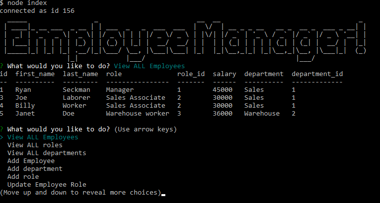

# Employee Tracker
  
  ## Description 
  
  This is a Command Line Application, that allows the user to manage employees in a work environment.  The user can access the mysql database of employee information to view employee, role and department information.  Through the use of the application the User can also add, remove and update the information to manage the employee workplace environment.

  ## Table of Contents

  * [Installation](#Installation)
  * [Usage](#Usage)
  * [Questions](#Questions)
  
  ##  Installation

  Make sure you run npm install in the correct directory.

  ## Usage

  In the command line, under the correct directory through node run the index.js file and then follow the instructions of the command line application.

  
  ## Questions

  For a video walkthrough check out this link: [Video Walkthrough](https://drive.google.com/file/d/1M-2p_vFIt2HNE5O6QhxLdi4jjPIH8kA_/view)

  If you have any questions you can check out my github account: [Rseckman](https://github.com/Rseckman)
  or contact me at rseckman@hotmail.com